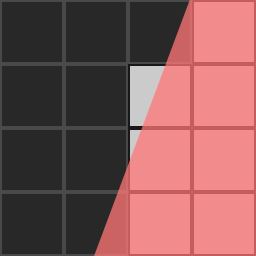

# Suavizado en costuras UV

>[!WARNING]
>
> **Problema**
> 
> Aparecen puntos o manchas oscuros en el borde de las costuras UV después de hornear:
> 
> 

>[!NOTE]
>
> **Explicación**
> 
> Cuando el Baker anota información en la textura, tiene que convertirse de geometría a píxeles. El procesamiento de esta información puede introducir [alias](https://en.wikipedia.org/wiki/Aliasing). El suavizado suele producirse porque la geometría de las coordenadas UV no está alineada con la cuadrícula de píxeles o porque las coordenadas UV no cubren suficientes píxeles para proporcionar una resolución suficiente.
> 
> En las siguientes imágenes, la geometría es la superposición roja. El panadero marcará un píxel como lleno si la geometría cubre más de la mitad de su superficie (los cuadrados blancos son píxeles completos y los cuadrados negros son píxeles vacíos). En la imagen de la derecha, la cuadrícula de píxeles tiene el doble de resolución, lo que permite una representación más precisa de la geometría.
> 
> 
> 
> 

>[!NOTE]
>
> **Solución**
> 
> * Aumente la resolución de textura de salida de los Bakers.
> * Aumente el ajuste de suavizado (nota : puede tardar más tiempo en calcularse).
> * Alinee las coordenadas UV con la cuadrícula de píxeles en el editor UV del software de modelado 3D.
> * Proporcione una mejor proporción de texto respecto a los UV.
