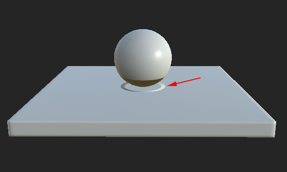

# Las partes de la malla se sangran entre sí

>[!WARNING]
>
> **Problema**
> 
> La geometría de malla se purga en otras partes y crea artefactos.
> 
> 

>[!NOTE]
>
> **Explicación**
> 
> El proceso de cocción envía rayos desde la superficie de la malla de bajo contenido de poli para golpear la malla de alto contenido de poli y crear una coincidencia. A veces los rayos van demasiado lejos y golpean la geometría equivocada, creando la hemorragia y artefactos.

>[!NOTE]
>
> **Solución**
> 
> Hay disponibles algunas soluciones para evitar este problema :
> 
> * Utilice la característica [Coincidencia por nombre](../../features/matching-by-name/matching-by-name.md) para aislar las mallas
> * Use una [jaula](https://helpx.adobe.com/es/substance-3d/unlisted/documentation/bake/cage-projection-172822982.html) para limitar la distancia del rayo.
> * Cambie la distancia de rayo predeterminada en los ajustes comunes del panadero a un valor inferior.
