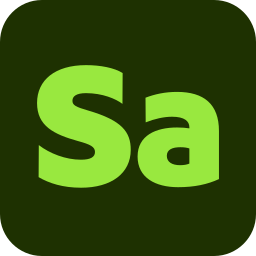

# Iconos de Substance 3D para artistas

<table>
  <tr style="border: 0;">
    <td style="border: 0;" valign="top"></td>
    <td style="border: 0;" valign="top"></td>
    <td style="border: 0;" valign="top"></td>
    <td style="border: 0;" valign="top"></td>
    <td style="border: 0;" valign="top"></td>
    <td style="border: 0;" valign="top"></td>
  </tr>
</table>

Los artistas que deseen incluir los iconos de las aplicaciones de Substance 3D en sus ilustraciones publicadas pueden descargarlos a continuación. Las imágenes utilizan el formato de SVG, por lo que se pueden utilizar a cualquier escala.

[Descargue una carpeta ZIP que contiene las versiones en color, negro y blanco de los iconos de la aplicación Substance 3D.](../../assets/substance3d-icons.zip)

## Biblioteca de Creative Cloud

Los usuarios de Creative Cloud pueden acceder a estos iconos en las aplicaciones de Creative Cloud a través de esta biblioteca compartida:

[Iconos de Substance 3D](https://shared-assets.adobe.com/link/4c83a12c-3948-4151-5be1-ad75f4a64be0)

## Ejemplos

