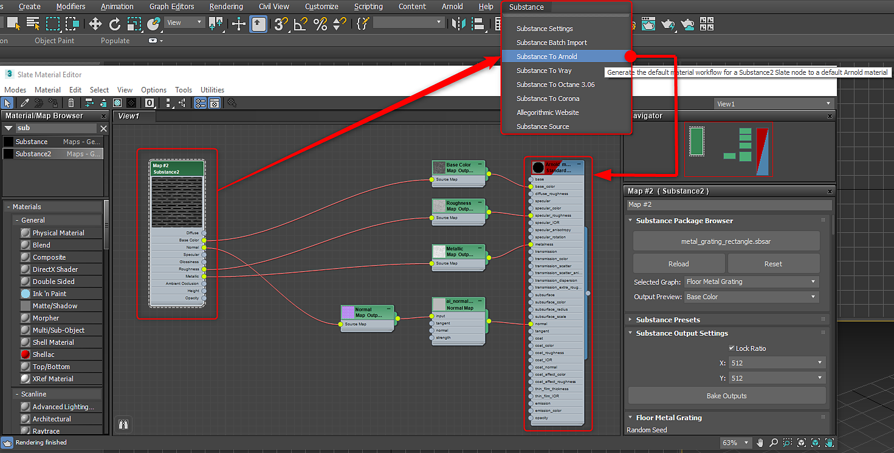

# Descripción general de Substance en 3ds Max

## Descripción general del complemento:

## Abrir un Substance

1. Abra el Editor de pizarra, busque Substance y arrastre el nodo Substance2 a la vista.
1. Haga doble clic en el nodo Substance para activar las propiedades y, en Explorador de paquetes de Substance, cargue un Substance.

   >[!NOTE]
   >
   > También puede arrastrar y soltar el archivo .sbsar en el Editor de pizarra para crear automáticamente el nodo e importar la barra de pizarra.
1. Si un Substance contiene varias gráficas, puede elegir la gráfica que desea generar como material en el menú desplegable Gráfica seleccionada.

   

   
1. Con el nodo Substance seleccionado, vaya al menú Substance y elija un procesador compatible. El material se creará y estará listo para aplicarse al objeto. Las texturas Substance se enlazan con el material de representación.

   | Renderizadores compatibles |
   | --- |
   | Arnold |
   | Variar |
   | Corona |
   | Octano |

   

## Cambio de resolución:

1. Establezca la resolución deseada para las texturas de Substance calculadas en los Ajustes de salida del Substance.
1. Para obtener una resolución de hasta 8 K, asegúrese de que está utilizando el motor de GPU, que se establece en [Configuración de Substance](../../../3d-applications/3ds-max/settings-1/substance-settings.md).

   

## Cambio de parámetros:

1. Pulse dos veces en el nodo Substance para cargar los parámetros del Substance en la ventana de parámetros.
1. Cambie los parámetros para actualizar las texturas del Substance automáticamente.

   {width="500px"}

## Configuración de previsualización de salida:

Puede definir un canal específico para la miniatura del nodo Substance.

1. En el menú desplegable Previsualización de salida , elija el canal que desea utilizar para la miniatura del nodo.

   

## Substance de segmentación:

Puede utilizar las propiedades Coordenadas para estructurar en mosaico las texturas del Substance y definir Canales de mapa.

