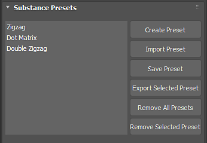

# Uso de ajustes preestablecidos

Los archivos de Substance pueden contener archivos de ajustes preestablecidos incrustados. Si un Substance tiene un archivo de ajustes preestablecidos incrustado, aparecerá en la ventana Ajustes preestablecidos del Substance. También puede crear sus propios ajustes preestablecidos en función de los ajustes que elija para los parámetros del Substance.

1. Crear ajuste preestablecido creará un nuevo ajuste preestablecido basado en los ajustes de parámetro que haya definido para el Substance en 3ds Max.
1. Importar ajuste preestablecido importará un archivo de ajuste preestablecido (.sbsprs).
1. Guardar ajuste preestablecido guardará los valores de parámetro del ajuste preestablecido seleccionado actualmente.
1. Exportar ajuste preestablecido seleccionado exportará el ajuste preestablecido a un archivo de ajuste preestablecido (.sbsprs).
1. Eliminar todos los ajustes preestablecidos eliminará los ajustes preestablecidos de la lista de ajustes preestablecidos.
1. Quitar ajuste preestablecido seleccionado eliminará solo el ajuste preestablecido seleccionado.
