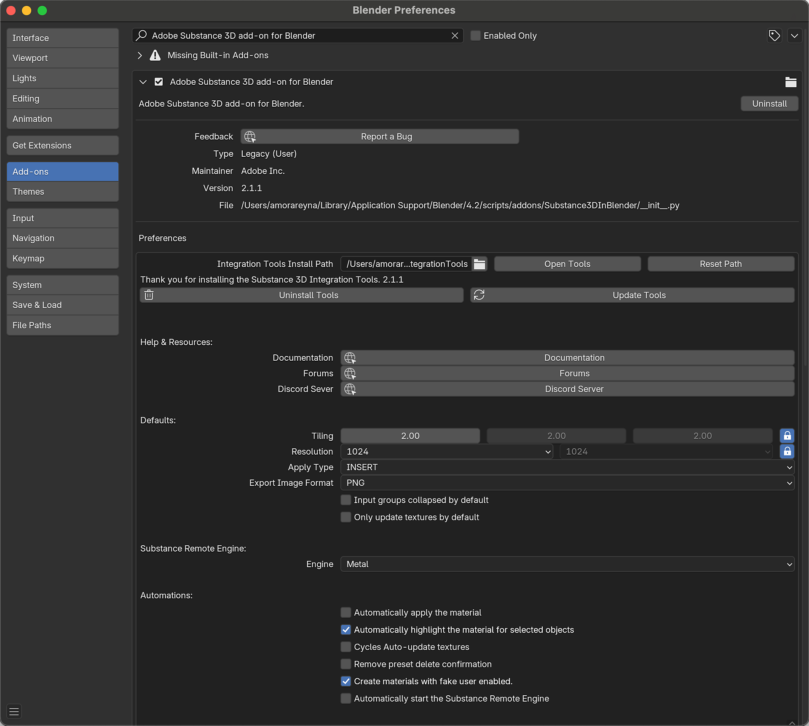

# Preferencias

Las preferencias del complemento se pueden encontrar en la ventana de preferencias de Blender. Vaya a Editar > Preferencias > Complementos y busque el nodo: Complemento Substance 3D de Adobe para Blender.

<table>
<tr style="border: 0;">
<td style="border: 0;" valign="top">

</td>
<td style="border: 0;" valign="top">

</td>
</tr>
</table>

<b>Desinstalar</b>: elimina el complemento del sistema y lo quita de la lista de complementos de Blender.

<b>Informar de un error</b> : Abre Substance 3D para Blender Discord.

<b>Aceptar carpeta de herramientas</b>: abre el explorador de archivos de Blender para elegir la ruta de instalación de Herramientas de integración de Substance.

<b>Abrir herramientas </b>: abra el explorador de archivos del sistema en la ubicación de la carpeta Herramientas de integración.

<b>Restablecer ruta</b>: restablece la ruta de la carpeta Integration Tools a la ubicación predeterminada.

<b>Herramientas de desinstalación</b>: elimina la versión instalada de las Herramientas de integración de Substance 3D.

<b>Herramientas de actualización</b>: abre el explorador de archivos para seleccionar el archivo zip de herramientas y actualizar las herramientas.

<b>Documentación</b>: abre la página de documentación Ecosystem and Plugins en el explorador.

<b>Foros</b>: abre los foros de la comunidad de Adobe en el explorador.

<b>Discord Server</b>: abre el Ecosistema y los complementos del servidor Discord en el navegador.

<b>Mosaico</b>: ajuste el mosaico X, Y y Z del material. El bloqueo se puede utilizar para desvincular los valores y ajustarlos individualmente.

<b>Resolución</b>: la resolución predeterminada para las texturas generadas. El bloqueo se puede utilizar para desvincular y establecer sus resoluciones de forma independiente.

<b>Aplicar tipo </b>: establece el comportamiento del botón Aplicar: <b>Insertar </b> sobrescribirá el material actual con el material del Substance seleccionado y <b>Anexar</b> agregará el material al objeto en una nueva ranura de material.

<b>Formato de imagen de exportación</b>: cuando las imágenes generadas en Blender se utilizan como entradas de imagen para un material de Substance, este formato se utiliza para guardar la imagen en la carpeta temporal.

<b>Los grupos de entrada están contraídos de forma predeterminada</b>. Activa o desactiva los grupos de entrada del material del Substance y se expanden o contraen de forma predeterminada.

<b>Actualizar solo texturas de forma predeterminada</b>: alterna la actualización del tiempo de los parámetros del Substance solo afecta a las texturas de salida en la red de Sombreado de Blender. Si se desactiva, se restablecerán las conexiones de nodo después de ajustar los parámetros. Se recomienda activar al añadir nodos adicionales a un material; de lo contrario, estos se desconectarán después de ajustar los parámetros.

<b>Motor remoto del Substance </b>: establece el hardware utilizado por el Motor remoto del Substance.

<b>Aplicar automáticamente el material</b> : cuando se crea un material de Substance, adjunta automáticamente el material a los objetos seleccionados en una nueva ranura de material.

<b>Resaltar automáticamente el material para los objetos seleccionados</b>: cambia el material resaltado en el panel Substance 3D si se selecciona un objeto con ese material.

<b>Ciclos: actualizar automáticamente las texturas</b>: fuerza la actualización de la textura en la ventana gráfica 3D mientras se usa la vista de procesamiento Ciclos.

<b>Eliminar confirmación de eliminación de ajustes preestablecidos</b>: elimina la ventana de confirmación que aparece al eliminar ajustes preestablecidos de materiales.

<b>Crear material con usuario falso habilitado</b>: establece que el tiempo en el que se crea el material sea el de &quot;usuario falso&quot; habilitado o deshabilitado. Los datos de Blender marcados como usuario falso no se purgan después de cerrarse, incluso cuando los datos no se utilizan.

<b>Iniciar automáticamente el motor remoto del Substance </b>: cambia si el motor remoto del Substance se inicializa cuando se inicia Blender. Si está desactivado, el motor remoto sólo se iniciará cuando un usuario cargue un botón o utilice el método abreviado de carga.

>[!NOTE]
>
> NOTA: Si se utiliza Substance Connector, el SRE debe estar activo para que la aplicación de envío detecte Blender como punto final.

<b>Ruta de biblioteca SBSAR</b> : la carpeta que se abre de forma predeterminada al pulsar el botón Cargar para buscar un archivo de substance.

<b>Carpeta temporal </b>: esta carpeta será la ubicación predeterminada donde se almacenen las texturas antes de guardar un archivo por primera vez.

<b>Copiar archivos .sbsar al guardar en</b> : cuando esta opción está habilitada, los archivos .sbsar se copian en la ruta relativa especificada al guardar el archivo. Esto puede facilitar el uso compartido de proyectos entre dispositivos.

<b>Al guardar, copia texturas a</b>: cuando se guarda un archivo por primera vez, las texturas de la carpeta temporal se copiarán en esta ubicación. La variable $matname se utiliza para crear subcarpetas para cada material.

<b>Ajuste preestablecido del sombreador</b>: establece el ajuste preestablecido del sombreador predeterminado que se utiliza al crear materiales de Blender a partir de archivos de sustancias. Se puede establecer como estándar para la asignación o proyección basadas en UV para la asignación basada en la proyección de cajas, esferas y cilindros.

<b>Desplazamiento de nivel medio</b>: el valor predeterminado es la base del desplazamiento en el nodo de Desplazamiento. Los valores superiores al valor por defecto empujarán las superficies hacia fuera y los valores inferiores al valor por defecto tirarán de las superficies hacia dentro.

<b>Escala de Desplazamiento</b>: valor de escala predeterminado en el nodo de Desplazamiento.

<b>Intensidad de emisión</b>: valor predeterminado de Intensidad de emisión en el nodo BSDF de principio.

<b>Fusión de proyección</b>: Establece la cantidad de fusión entre ángulos para los sombreadores del método de proyección.

<b>Mezcla AO</b>: cuando la Oclusión ambiente está activada como salida, este valor determina el valor de factor predeterminado del nodo MixRGB que se utiliza para combinar las texturas de color base y de Oclusión ambiente.

<b>Salidas</b>: las salidas individuales de los materiales se pueden habilitar o deshabilitar. El espacio de color predeterminado, el formato de archivo y la profundidad de color de las salidas individuales también se pueden ajustar.

<b>Accesos directos </b>: personaliza las teclas de método abreviado utilizadas para abrir un menú flotante, cargar un material de Substance y aplicar el material actual. Las actualizaciones de acceso directo requieren un reinicio para que surtan efecto.
