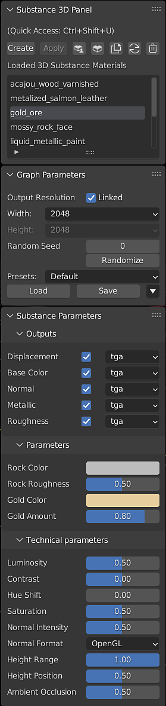

# El panel Substance 3D

## Controles de panel

**Create**: abre el explorador de archivos para seleccionar un material de Substance 3D. De forma predeterminada, se crea un material de fusión utilizando texturas generadas a partir del archivo .sbsar.

**Aplicar** : adjunta el material de Substance 3D seleccionado a los objetos seleccionados en una nueva ranura de material. Esto no anula las asignaciones de material anteriores en el objeto.

**Substance 3D Community Assets**: abre la página Substance 3D Community Assets en el navegador web.

**Substance 3D Assets**: abre la página de origen de la Substance 3D Assets en el explorador web.

**Duplicar material de Substance 3D seleccionado**: carga una nueva instancia del material de Substance 3D seleccionado. Los parámetros de diferentes instancias del mismo material de Substance se pueden ajustar de forma independiente.

**Actualizar**: vuelve a cargar el material de Substance 3D

>[!WARNING]
>
> **Advertencia:**
> 
> Al utilizar el botón Actualizar, se desharán los cambios realizados por el usuario en el gráfico de sombreado. Copie los nodos añadidos por el usuario antes de actualizar para pegarlos en el gráfico después de la actualización.

**Quitar** : elimina el material de Substance 3D seleccionado del panel.

>[!NOTE]
>
> El material Blender creado a partir del material Substance permanecerá en el proyecto. Puede eliminarse o eliminarse de los objetos manualmente.

**Materiales de Substance 3D cargados**: muestra una lista de los materiales de Substance que se han cargado en el archivo .blend.

## Parámetros de gráficos

**Resolución de salida**: menús desplegables para la resolución de height y con. Estos se pueden desvincular para ajustar los valores de forma independiente.

**Raíz aleatoria y aleatoria**: el botón aleatoria genera un nuevo valor de semilla aleatorio para cambiar parámetros que pueden usar valores aleatorios. La velocidad aleatoria también se puede establecer manualmente.

## Uso de ajustes preestablecidos

Los archivos SBSAR se pueden publicar con ajustes preestablecidos, que se pueden encontrar en el cuadro desplegable Ajuste preestablecido. Para crear tus propios ajustes preestablecidos, ajusta los parámetros como desees y usa el botón **Guardar**. Hay opciones adicionales para exportar el ajuste preestablecido seleccionado como archivo .sbsprs y para eliminar el ajuste preestablecido seleccionado de la lista desplegable. El botón **Load** se puede usar para importar ajustes preestablecidos de archivos .sbsprs.

## Parámetros de Substance

Los parámetros expuestos en Substance Designer se pueden ajustar mediante los controles Parámetro de Substance . Estos parámetros son establecidos por el creador del Material de los Substance y variarán entre los materiales. Al ajustar estos parámetros, se actualizarán las texturas generadas, tal y como se indica en el icono de procesamiento situado junto al nombre del material en la sección Materiales de Substance 3D cargados .

El formato de archivo de las texturas de salida se puede alternar y cambiar en los menús desplegables.

Para obtener más información, consulte [Exponer un parámetro](https://experienceleague.adobe.com/en/docs/substance-3d-designer/using/substance-graphs/manage-parameters/exposing-a-parameter) en la página de documentación de Designer.

## Parámetros técnicos

Los materiales de Substance pueden tener un conjunto de parámetros técnicos. Se trata de controles adicionales para la corrección de color y otros ajustes de material.
