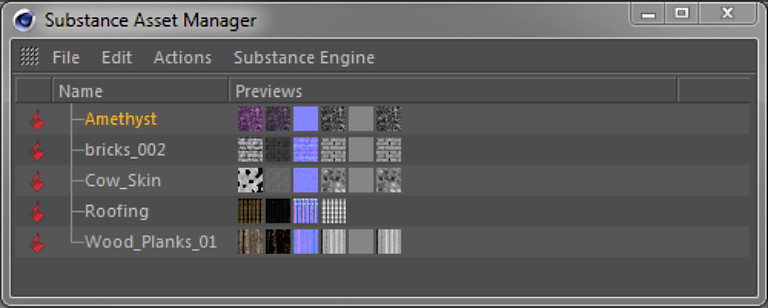
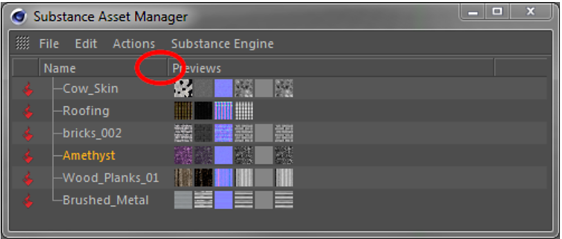

# Substance Asset Manager

La ventana Substance Asset Manager muestra todos los Substance cargados en una escena. Aquí puede añadir, eliminar y reorganizar Substance.

Al seleccionar (clic izquierdo) un Substance dentro de Substance Asset Manager, se abre el Substance en el Administrador de atributos de Cinema 4D. Aquí puede cambiar los parámetros y las entradas del Substance de fotogramas clave como cualquier otro parámetro de Cinema 4D.

>[!NOTE]
>
> El Administrador de atributos dispone de un modo de Substance de recursos especial, muy útil para disponer de un Administrador de atributos específico para Substance en el diseño de Cinema 4D.

{width="500px"}

## Menú Archivo

## Cargar recurso...

Cargue un nuevo Substance en la escena (al igual que en el menú Complementos ).

Cerrar

Cierra Substance Asset Manager. Por supuesto, los Substance cargados se quedarán en el lugar.

## Menú Edición

## Seleccionar todos los Substance

Selecciona todos los Substance que aparecen en la lista de Asset Manager. Lo mismo se puede lograr pulsando Ctrl+a, mientras el ratón se desplaza sobre Asset Manager.

## Anular selección de todos los Substance

Anula la selección de todos los Substance enumerados en Asset Manager. Lo mismo se puede lograr pulsando Mayús+Ctrl+a, mientras el ratón se desplaza sobre Asset Manager.

## Seleccionar de los materiales seleccionados

Selecciona todos los Substance a los que hacen referencia los materiales *seleccionados* actualmente.

## Seleccionar de los materiales marcados

Selecciona todos los Substance a los que hacen referencia los materiales *marcados* actualmente. En Cinema 4D, un material se marca si se selecciona un objeto o una etiqueta que utilice este material.

## Seleccionar material(s)

Selecciona todos los materiales que hacen referencia a los Substance seleccionados actualmente.

## Menú Acciones

## Crear material(s)

Cree nuevos materiales de Cinema 4D a partir de los Substance seleccionados actualmente. Los canales de materiales se inicializarán automáticamente con sombreadores de Substance que hacen referencia a los canales de salida respectivos de los Substance.

## Duplicar Substance(s)

Duplicar los Substance seleccionados actualmente. Esto puede resultar útil para utilizar el mismo Substance con conjuntos de parámetros diferentes en varios materiales.

## Volver a importar Substance(s)

Esta función se puede utilizar para volver a los valores predeterminados de un Substance o para integrar cambios externos (por ejemplo, del Substance Designer).\
Nota: Se perderán **todos los** cambios de parámetro en las entradas del Substance.

## Quitar Substance(s)

Quita de la escena los Substance seleccionados actualmente. Lo mismo se puede lograr pulsando la tecla Supr mientras el ratón pasa por encima de Asset Manager.

## Eliminar Substance no utilizados

Elimina todos los Substance a los que actualmente no se hace referencia en ningún material.

## Menú Substance Engine

El contenido de este menú depende del sistema operativo en el que se ejecute Cinema 4D. El cambio del Substance Engine solo surtirá efecto después de reiniciar el sistema de Cinema 4D.

## Menú contextual

Al hacer clic con el botón derecho en un Substance seleccionado, se mostrará el menú contextual. Su funcionalidad es la misma que la de las funciones con nombre idéntico de los menús anteriores:

* Quitar
* Crear material(s)
* Duplicar Substance
* Volver a importar Substance
* Seleccionar todos los Substance
* Anular selección de todos los Substance
* Seleccionar material(s)

## Arrastrar y soltar

Puede interactuar con Substance Asset Manager arrastrando y soltando. Hay varias opciones disponibles:

* Cargue los Substance en la escena arrastrándolos y soltándolos desde el Explorador o el Finder simplemente soltándolos en el Administrador de recursos de Substance.
* Los Substance se pueden arrastrar al campo de vínculo de los sombreadores de Substance para conectar un sombreado y un recurso de Substance.
* Si está en modo Sin ordenar (consulte a continuación), puede reorganizar los Substance en Asset Manager arrastrándolos a una nueva ubicación.

## Ordenación en Substance Asset Manager

## Modo sin ordenar

## El administrador de recursos de Substance está en **modo sin ordenar de forma predeterminada**. La celda de encabezado de la columna de nombre no muestra una flecha a la derecha. Puede utilizar la función de arrastrar y soltar para reorganizar las sustancias como desee.

{width="500px"}

{width="500px"}

## Previsualizaciones en Substance Asset Manager

## Substance Asset Manager muestra pequeños iconos con vistas previas de los canales disponibles para cada Substance.

## Las vistas previas simplemente se muestran en el orden de los canales de salida en el Substance. La columna en la que se muestra una vista previa no tiene significado.
