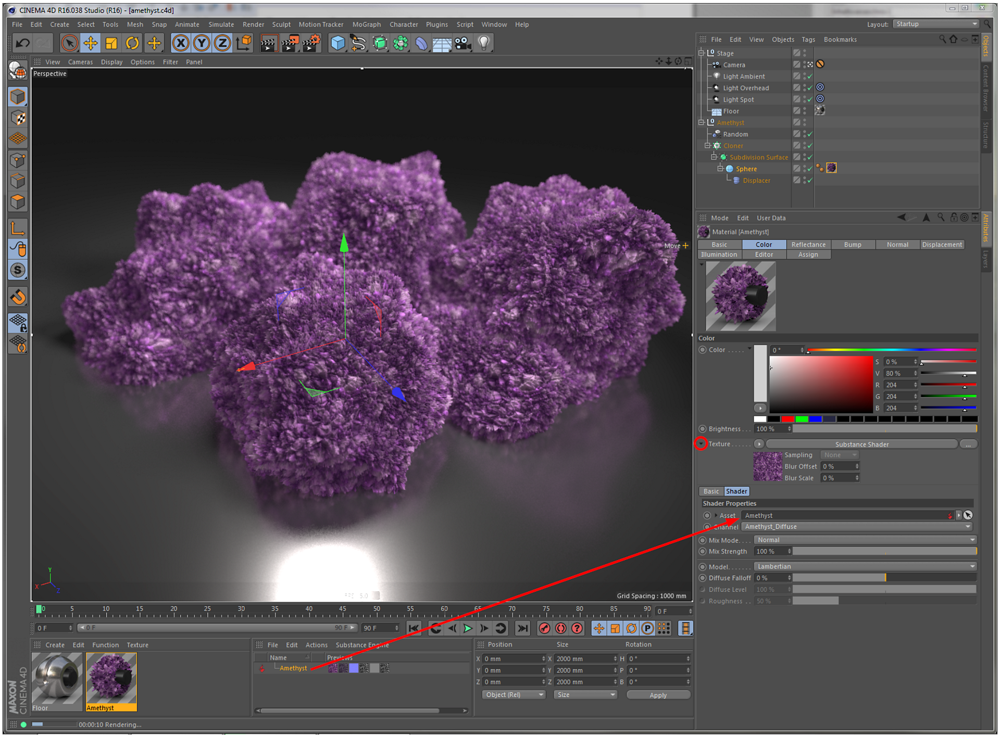

# Comentarios visuales de Substance animados

Para tener información visual de un Substance animado en la ventana gráfica de Cinema 4D, la opción Vista previa animada debe estar activada para estos materiales.

Esta opción se encuentra en el Editor de materiales en Editor (consulte a continuación). Si se ha creado un material mediante el comando Crear materiales (Create Material(s)), esta opción se activará de forma predeterminada.

{width="500px"}

## Creación de material(s)

Con el comando Crear materiales del Administrador de recursos de Substance puede crear materiales de Cinema 4D de forma rápida y sencilla mediante un Substance.

Por lo tanto, se utilizará la siguiente asignación de canales:

|  |  |
| --- | --- |
| **Canal de salida del Substance** | **Canal de material de Cinema 4D** |
| Difusión | Color |
| Emisivo | Luminancia |
| Reflejo | Reflejo |
| Entorno | Entorno |
| Relieve | Relieve |
| Opacidad | Alfa |
| Especular | Reflejo/Specular predeterminado |
| Altura | Desplazamiento |
| Normal | Normal |

Esta relación solo se utiliza para el comando Crear materiales y el material creado se puede modificar posteriormente. Puede que desee utilizar este comando para crear rápidamente un material base, que se puede ajustar ajustando solo unos pocos canales.

Dentro del sombreador de Substance no se limita a los pocos canales de salida mencionados anteriormente, pero de hecho puede utilizar cualquier canal de salida que un Substance pueda proporcionar.

## Creación manual de materiales del Substance

En lugar de utilizar el comando Crear materiales, también puede crear materiales manualmente mediante el sombreador de Substance.

Solo tiene que seleccionar el sombreador del Substance en un canal de materiales y arrastrar el Substance que desee utilizar. El siguiente paso es seleccionar el canal de salida del Substance que se utilizará en este sombreado, y ya ha terminado.

Así es:

{width="800px"}

Este método ofrece mucha libertad creativa y te permite hacer lo siguiente:

* Asigne canales de salida de Substance a canales de material de Cinema 4D arbitrarios. No hay necesidad de restringirse a solo usarlos en los canales previstos.
* Asigne un único canal de salida de Substance a varios canales de material de Cinema 4D.
* Asigne canales de salida de varios Substance a un solo material de Cinema 4D.

## Limitaciones

* Los fotogramas clave de los parámetros de entrada del Substance se muestran en la cronología, pero no en el regulador de potencia de Cinema 4D (el regulador de la cronología situado debajo de los puntos de visión).
* Debido a una limitación, no se deben utilizar perfiles de color personalizados en los canales de salida del Substance.
* En determinadas circunstancias, las entradas de imagen de los Substance se interrumpirán\
  El comando Combinar... de Cinema 4D, que combina dos escenas en una sola. Esto sucede si la escena que se va a combinar tiene Substance ubicados en su directorio de proyecto con entradas de imagen que hacen referencia a imágenes del directorio de proyecto. En estos casos, las entradas de imagen tendrán que volver a vincularse manualmente posteriormente.
* Si los Substance se encuentran en la carpeta del proyecto (o en algún otro lugar de la ruta de búsqueda global), no funcionarán en Cineware. En este caso, se muestran en rojo, como si faltara el Substance. Para solucionar este problema, los archivos de Substance deben almacenarse fuera del directorio del proyecto, por lo que se hace referencia a ellos mediante una ruta absoluta. Puede utilizar el parámetro Filename para cambiar la ubicación del archivo después de que los archivos se hayan movido fuera de la ruta del proyecto.
