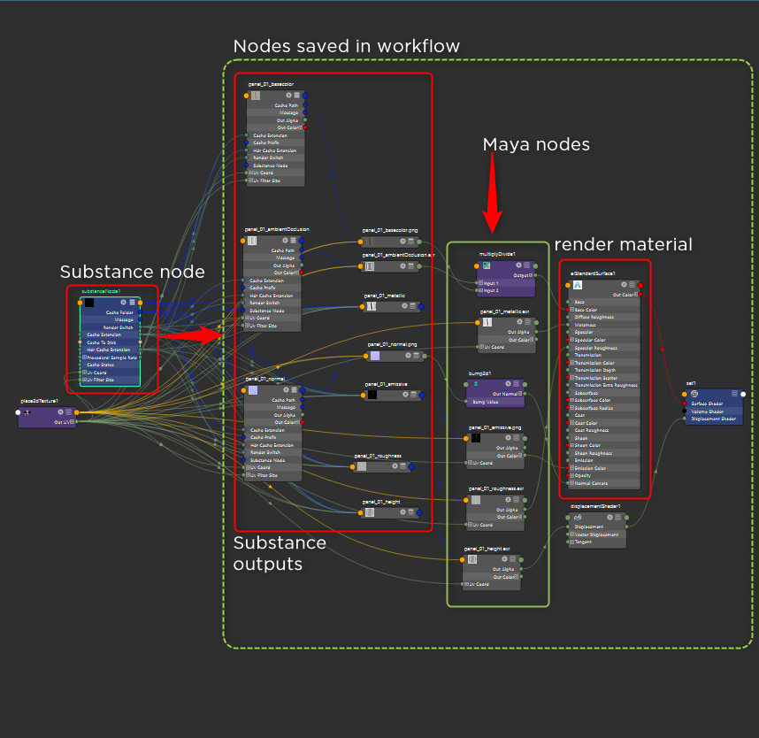

# Uso de flujos de trabajo

En Flujos de trabajo, puede elegir o crear ajustes preestablecidos de procesamiento para salidas de Substance. Estos ajustes preestablecidos son redes de sombreado para un procesador como Arnold o Vray.

>[!NOTE]
>
> **Ubicaciones preestablecidas de flujo de trabajo**
> 
> **Windows**:\
> C:\Users\\Documents\maya\2022\substance\workflows\generated\
> **MacOS**:\
> /Usuarios//Biblioteca/Preferences/Autodesk/maya//substance/workflows/generate\
> **Linux**:\
> /home/maya/substance/workflows/generate

Para utilizar un flujo de trabajo, elija el ajuste preestablecido en la lista desplegable y, a continuación, haga clic en el botón Crear red de sombreadores.

## Creación de un flujo de trabajo

Puede crear su propio flujo de trabajo y agregarlo a la lista Flujo de trabajo del procesador. Al añadir un nuevo flujo de trabajo, cualquier nodo creado después del nodo Substance se guardará en el flujo de trabajo. Esto le permite crear cualquier número de nodos de sombreado para crear una red de sombreadores personalizada completa que se pueda guardar como un flujo de trabajo preestablecido.

##  Administrar flujos de trabajo

### Guardar flujos de trabajo personalizados

1. Cree manualmente salidas de Substance y conéctelas a un material como aiStandardSurface.
   1. Puede utilizar cualquier Maya o renderizar nodos específicos para crear la red de sombreadores.
1. Haga clic en el botón **Crear flujo de trabajo** e introduzca un nombre para el ajuste preestablecido de flujo de trabajo.

### Duplicación de flujos de trabajo

Puede duplicar un flujo de trabajo haciendo clic en el botón **Duplicar flujo de trabajo**.

### Cambiar nombre y sobrescribir flujos de trabajo

Puedes cambiar el nombre de los flujos de trabajo existentes, así como sobrescribir los flujos de trabajo con datos actualizados, utilizando los botones seleccionados **Cambiar nombre** y **Sobrescribir**.

### Eliminación de flujos de trabajo

Puede eliminar los flujos de trabajo existentes con el botón Quitar flujo de trabajo.
