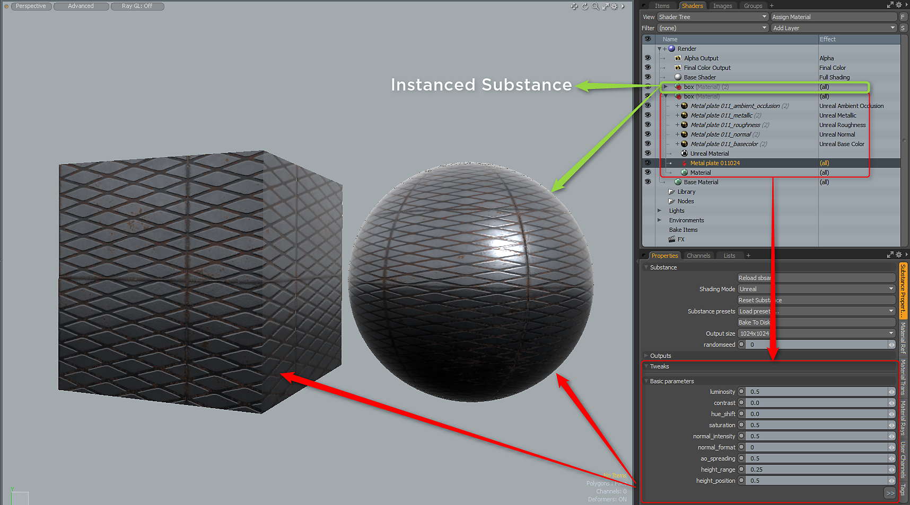

# Copiar/Duplicar Substance

## Copiar/Instancia/Duplicar Substance

## Instanciación

Para crear una instancia de Substance, debe seleccionar el grupo de materiales del Substance, hacer clic con el botón derecho y seleccionar Instancia. Esto creará una instancia del grupo Material de Substance que se puede aplicar a otras mallas. Para realizar cambios, debe ajustar las propiedades del Substance en el elemento del Substance de origen, que es el Substance\
las instancias a partir de las cuales se crearon.

## Duplicar

Para duplicar una sustancia, haga clic con el botón derecho en el elemento de sustancia y elija Duplicar. Se duplicarán el contenido y los resultados.

## Copiar

No se admite copiar y pegar elementos de una sustancia.
