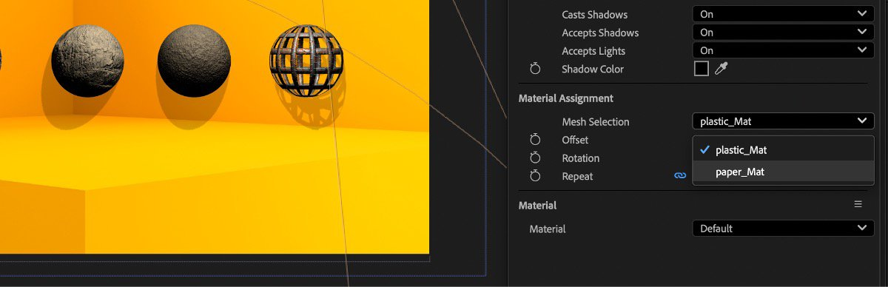

# After Effects

Adobe After Effects admite el uso de archivos SBSAR, por lo que puede aplicar materiales a los objetos 3D con todos los parámetros personalizados que admite el formato SBSAR.

[Puede obtener más información sobre cómo usar archivos SBSAR en After Effects aquí.](https://helpx.adobe.com/after-effects/using/apply-substance-3d-materials.html)
