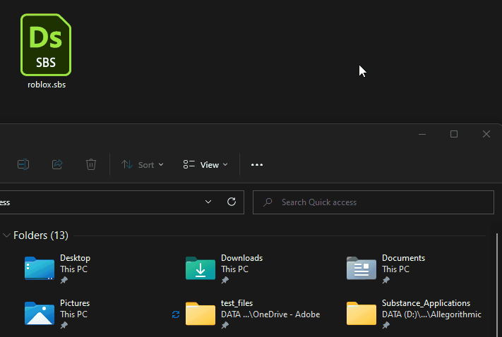

# Roblox

[Roblox](https://www.roblox.com/) es una plataforma para experiencias envolventes de múltiples jugadores en 3D. Roblox Studio, la herramienta de diseño de Roblox, admite el flujo de trabajo de rugosidad metálica PBR.

<table>
<tr style="border: 0;">
<td width="58.30%" style="border: 0;" valign="top">

## Plantilla de Substance 3D Designer

Para crear texturas para Roblox, puedes usar el archivo de Substance 3D que aparece a continuación como una plantilla de [Substance que compone gráficos](https://experienceleague.adobe.com/en/docs/substance-3d-designer/using/substance-graphs/substance-compositing-graphs) en [Substance 3D Designer](https://experienceleague.adobe.com/en/docs/substance-3d-designer/home).

[{width="64px"}](https://helpx.adobe.com/content/dam/roblox.sbs)

Esta plantilla de gráfico permite la preconfiguración de los nombres y tipos de archivos de textura finales. Esta plantilla se puede instalar y reutilizar para crear nuevos materiales que siempre sigan las directrices de materiales de Roblox.

</td>
<td width="41.60%" style="border: 0;" valign="top">

{width="200px"}

</td>
</tr>
</table>

## Flujo de trabajo de Designer a Roblox

<table>
<tr style="border: 0;">
<td style="border: 0;" valign="top">

### Instalar plantilla

Primero, *instale* la plantilla Roblox.

* Descargue el archivo de plantilla vinculado anteriormente.
* Vaya al directorio de documentos de usuario de Designer:
* (Escritorio del Creative Cloud) `/Documents/Adobe/Adobe Substance 3D Designer`\
  (Vapor) `/Documents/Allegorithmic/Substance Designer/`
* Cree una carpeta de plantillas.
* Coloque el archivo en esa carpeta.

</td>
<td style="border: 0;" valign="top">

{width="512px"}

</td>
</tr>
</table>

<table>
<tr style="border: 0;">
<td style="border: 0;" valign="top">

### Detectar plantilla

Luego, haz que Designer *vigile* la carpeta de plantillas para buscar plantillas de gráficos.

* En Designer, vaya a **Editar > Preferencias...**
* En la ventana [Preferencias](https://experienceleague.adobe.com/en/docs/substance-3d-designer/using/workspace/preferences/preferences-window), vaya a **Proyectos > Proyecto de usuario > General**
* En la lista **Directorios de plantillas**, haga clic en el botón **+**
* Vaya al directorio `templates` y haga clic en **Seleccionar carpeta**
* Haga clic en el botón **Aceptar**
* Vaya al gráfico **Archivo > Nuevo > Substance...**
* Compruebe que la plantilla `Roblox` aparece en la parte inferior de la lista de plantillas en la ventana [Nuevo gráfico de Substance](https://helpx.adobe.com/es/substance-3d/unlisted/documentation/sddoc/create-a-graph-102400068.html)

</td>
<td style="border: 0;" valign="top">

{width="512px"}

</td>
</tr>
</table>

<table>
<tr style="border: 0;">
<td style="border: 0;" valign="top">

### Exportar texturas

Cree un gráfico con la plantilla Roblox y exporte mapas de bits de ese gráfico una vez que haya terminado de trabajar en un material.

* En la ventana [Nuevo gráfico de Substance](https://helpx.adobe.com/es/substance-3d/unlisted/documentation/sddoc/create-a-graph-102400068.html), seleccione la plantilla `Roblox`
* Establezca cualquier identificador y otros parámetros para el gráfico y haga clic en **Aceptar**
* Trabaja en tu material en la [vista de gráficos](https://experienceleague.adobe.com/en/docs/substance-3d-designer/using/workspace/graph-view/the-graph-view). Consulta [aquí](https://experienceleague.adobe.com/en/docs/substance-3d-designer/using/getting-started/workflow-overview) para empezar con el flujo de trabajo
* Cuando haya terminado, vaya a **Herramientas > Exportar mapas de bits...** en la vista de gráfico *barra de herramientas*
* En la ventana [Exportar mapas de bits](https://experienceleague.adobe.com/en/docs/substance-3d-designer/using/substance-graphs/exporting-bitmaps), establece una ruta de **destino** válida, asegúrate de que *todas* las salidas estén *comprobadas* y haz clic en **Exportar**
* Compruebe que las texturas se exportan correctamente a la ruta **Destino**

</td>
<td style="border: 0;" valign="top">

{width="512px"}

</td>
</tr>
</table>

<table>
<tr style="border: 0;">
<td style="border: 0;" valign="top">

### Crear material en Roblox

En Roblox, cree un valor de tipo Material Variant y asigne las texturas exportadas desde Designer.

* Seleccione la pestaña **Modelo** y haga clic en **Administrador de materiales**
* Seleccione una *plantilla de material* y haga clic en el botón **Crear variante**
* En la ventana **Crear variante**, establezca un nombre para el material
* Para *cada canal de material*, haz clic en el botón **Importar** y selecciona la textura correspondiente exportada desde Designer
* Haga clic en **Guardar**

</td>
<td style="border: 0;" valign="top">

{width="512px"}

</td>
</tr>
</table>

<table>
<tr style="border: 0;">
<td style="border: 0;" valign="top">

### Aplicar material

Utilice su nueva variante de material en su escena de Roblox

* *Seleccionar* cualquier parte o malla en la escena de Roblox
* En el **Administrador de materiales**, selecciona tu *variante de material* y haz clic en el botón **Aplicar a las partes seleccionadas**

>[!NOTE]
>
> Si el color de las texturas es diferente en Roblox, comprueba el atributo **Color** en la categoría **Apariencia** en las propiedades del objeto al que se aplica la Variante de material y asegúrate de que esté establecido en *blanco puro*, es decir, RGB (255, 255, 255), que se etiqueta como *blanco institucional* en Roblox.

</td>
<td style="border: 0;" valign="top">

{width="512px"}

</td>
</tr>
</table>

<table>
<tr style="border: 0;">
<td style="border: 0;" valign="top">

### Ajustar mosaico

La cantidad de repetición del material en una superficie - es decir, baldosas - se puede ajustar en cualquier momento.

* En el **Administrador de materiales**, selecciona tu *variante de material* y haz clic en el botón **Editar**
* En la ventana **Editar variante**, ajusta el valor de la propiedad **Studs Per Tile** en **Adicional**: un valor *inferior* produce *más* repeticiones

</td>
<td style="border: 0;" valign="top">

{width="512px"}

</td>
</tr>
</table>
