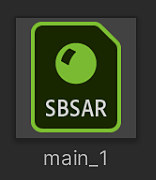

# Cambio de parámetros

<table>
<tr style="border: 0;">
<td style="border: 0;" valign="top">

Se puede acceder a los parámetros del material del Substance en el objeto de Gráfico de Substance (SGO).

1. En la ventana Proyecto, seleccione el logotipo del archivo sbsar para el gráfico que desea personalizar. El sbsar tiene el logo verde &quot;SBSAR&quot;.

   

## Propiedades del procedimiento

1. **Generar todas las salidas**: Genera todos los resultados del archivo sbsar del Substance. De forma predeterminada, solo se crean las salidas utilizadas por los sombreadores estándar.
1. **Generar Mapas Mip**: Generará texturas mip para cada salida de Substance.
1. **Raíz aleatoria**: Este botón cambiará la semilla aleatoria que utiliza el gráfico del Substance para generar las texturas. Si se cambia este valor, se creará un nuevo resultado para la textura calculada en función del valor de semilla.
1. Los parámetros expuestos en el archivo de Substance están disponibles en Unity. El control Editor se basa en el tipo de parámetro creado para el Substance.
1. **Administración de ajustes preestablecidos:** Puedes exportar o importar archivos de ajustes preestablecidos de Substance (barras). Al exportar un ajuste preestablecido, se crea un archivo de ajuste preestablecido basado en la configuración de parámetros del Substance. Puede exportar archivos de ajustes preestablecidos desde Substance Designer y Substance Player, que se pueden importar mediante el botón Importar ajuste preestablecido . Esto resulta útil para compartir los ajustes preestablecidos del Substance entre aplicaciones y equipos.

</td>
<td style="border: 0;" valign="top">

</td>
</tr>
</table>
