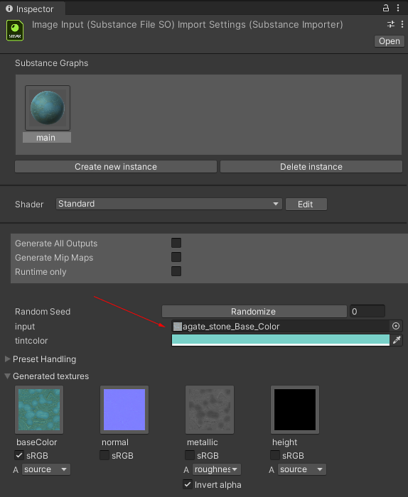
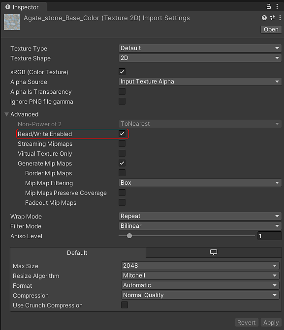

# Uso de entradas de imagen

Para utilizar una imagen en un parámetro de entrada de un Substance:

1. En la ventana del inspector del Gráfico de Substance puede seleccionar texturas del proyecto para asignarlas a las entradas de imagen.

   
1. Tenga en cuenta que al seleccionar una textura, se activará el campo de texturas &quot;Lectura/Escritura activada&quot;, ya que es necesario para leer los datos de textura en el material de Substance

   
