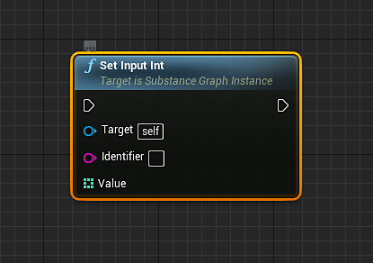

# Modelo(UE4): Parámetros de material de Substance

## Cambiar un parámetro float:

Utilizará [Establecer nodo flotante de entrada](https://helpx.adobe.com/es/substance-3d/unlisted/documentation/integrations/blueprint-node-reference-151584784.html) para cambiar un flotante, color(float4) y parámetros booleanos de substance.

1. Cree una variable con un tipo de &quot;Instancia de Gráfico de Substance&quot; como referencia.
1. Cree un nodo flotante Set Input y establezca el destino como la variable Instancia de Gráfico de Substance.
1. En el nodo flotante Definir entrada, establezca el identificador como el nombre del parámetro de Substance que se va a cambiar.\
   *\* Puede encontrar el nombre del identificador abriendo el Substance INST y pasando el ratón sobre el nombre del parámetro. El nombre del identificador aparecerá en la ventana emergente de información sobre herramientas.*
1. En el nodo flotante de entrada, arrastre una conexión y cree un nodo de matriz de creación. El nodo Make Array tendrá un índice de 0. El índice 0 corresponde al valor flotante.
1. Cree un nodo de procesamiento asíncrono o sincronizado y conecte la línea de ejecución del flotante de entrada definida al nodo de procesamiento. Establezca las instancias que se van a procesar en la variable de instancia de Gráfico de Substance.\
   *\* La sincronización asíncrona no es bloqueante y la sincronización lo es.*

{width="800px"}

## Parámetros booleanos

Los parámetros booleanos se cambian utilizando Set Input Bool.

{width="800px"}

## Parámetros de color

Los parámetros de color se cambian mediante Definir color de entrada.

{width="800px"}

## Cambiar un parámetro Integer:

Los parámetros enteros funcionan igual que el valor de Set Input Float. Utilizará el nodo Set Input Integer.

## Identificadores

Puede encontrar el identificador de un parámetro en la sustancia INST. Pase el ratón sobre el parámetro y la información sobre herramientas mostrará el nombre del identificador. Éste es el nombre definido en el campo identificador de la salida en Substance Designer.

{width="800px"}
