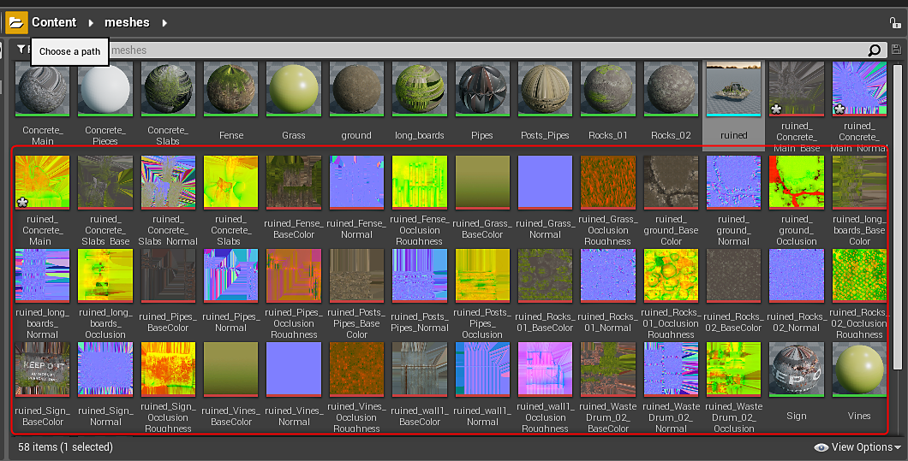
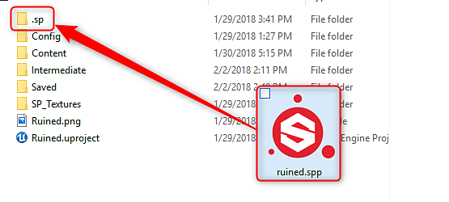

# Live Link en UE4

>[!WARNING]
>
> Live Link en Unreal Engine ya no es compatible. Los usuarios con una versión anterior del plugin donde se utiliza Live Link podrán seguir utilizando la función.

>[!WARNING]
>
> Live Link no funciona con mallas BSP UE4. El recurso que envíe debe ser un archivo de modelo importado en su proyecto UE4

## Establecimiento del vínculo con el Substance Painter

1. Abrir Substance Painter
1. Haz clic con el botón derecho en el contenido que deseas enviar a Painter en el Navegador de contenido y elige &quot;Enviar a Painter&quot;.

   {width="400px"}
1. La malla aparecerá en Substance Painter y podrá comenzar a aplicar texturas. A medida que trabaje, las texturas se enviarán a UE4 y se aplicarán a los materiales. El punto verde del icono UE4 de la barra de herramientas indica que el vínculo está activo y envía texturas.

   

   1. Puede pausar la transmisión de datos en las opciones de configuración del complemento. Vaya a Complementos>dcc-live-link y elija Configurar. Desactive la opción Activar streaming para detener el envío de datos a UE4.

      
1. Las texturas de Painter aparecerán en el navegador de contenido y se aplicarán al material en UE4.

   {width="500px"}
1. Se creará un proyecto de Substance Painter (.spp) en la carpeta del proyecto UE4 en una carpeta denominada &quot;.sp&quot;

   

## Restablecimiento de un vínculo con el Substance Painter

Puede continuar donde lo dejó después de cerrar Painter o Unity.

1. Abra el proyecto .spp en el Substance Painter ubicado en la carpeta Unity project>assets>.sp.
1. Haga clic con el botón derecho en la malla del navegador de contenido y elija &quot;Enviar a Painter&quot; para restablecer el vínculo.

   {width="600px"}
