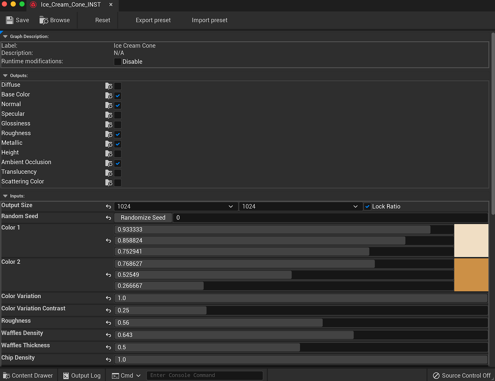

# Descripción del complemento - UE5

## Importar un Substance

1. En el Navegador de contenido, haga clic en el botón Importar y busque el archivo .sbsar del Substance.
1. En las opciones de importación de Substance, puede definir el nombre de INST y Material que se creará. La importación creará un Substance INST y Factory junto con las texturas generadas. El material A UE4 se creará con las texturas del Substance como entrada en los canales de materiales.

## Cambio de parámetros

1. Haga doble clic en el elemento INST del Substance para abrir la ventana Parámetros.
1. El botón Restablecer restablecerá los parámetros de la sustancia a sus valores predeterminados. Los ajustes preestablecidos Exportar e Importar exportarán un archivo de ajustes preestablecidos de Substance (.sbspr) mediante los valores establecidos en el editor. También puede importar un ajuste preestablecido.
1. En las salidas, puede desactivar y activar las salidas que generan texturas.
1. El tamaño de salida le permitirá cambiar el tamaño de la textura.
1. Raíz aleatoria cambiará el valor de la semilla para generar las texturas. Esto es bueno para aleatorizar materiales.
1. La sección Parámetros permite retocar el material.

