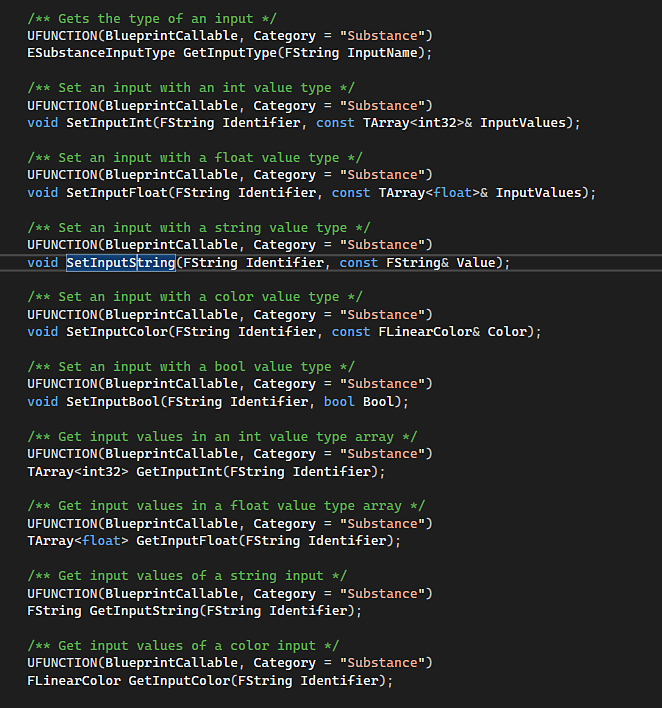

# Unreal Engine 5 Scripting

El Substance del plugin Unreal Engine se puede crear mediante scripts. Los métodos se enumeran y anotan en el archivo SubstanceGraphInstance.h del complemento, que normalmente se encuentra en el siguiente directorio al instalar el complemento en la tienda:

* **Instalación del motor**: [UE\_5.X.X ubicación]\Engine\Plugins\Marketplace\Substance\Source\SubstanceCore\Classes\SubstanceGraphInstance.h
* **Instalación del proyecto**: [ubicación de la carpeta del proyecto]\Plugins\Runtime\Substance\Source\SubstanceCore\Classes\SubstanceGraphInstance.h

  

`BlueprintCallable` indica que el método también se puede utilizar en el Editor de modelo.

## Scripts en el editor de Python de Unreal Engine

Cuando se utilizan los métodos enumerados en el archivo SubstanceGraphInstance.h en el editor de Python de Unreal Engine, se deben convertir de Caso Pascal a Caso Serpiente (con letras en minúscula y subrayado entre cada palabra). Por ejemplo, `SetInputColor` se convierte en `set_input_color`.

Se puede acceder al Editor de Python en Unreal Engine a través de Ventana > Registro de salida y estableciendo el menú desplegable de la parte inferior izquierda en Python.

## Scripts de ejemplo

A continuación se muestra un conjunto de ejemplos de secuencias de comandos que se pueden utilizar en Python Editor.

## Creación de un material de Substance

```
## Python example on creating a Substance material.

 

import unreal 

 

## Create factory

sf = unreal.SubstanceFactory() 

factory = sf.import_archive("/Game", "C:/4d/unreal/stylized_lava_cracked.sbsar") 

graph_descs = factory.get_graph_descs() 

mats = unreal.SubstanceUtility.get_substance_included_materials() 

 

## Create graph instance

for graph_desc in graph_descs: 

    print(graph_desc) 

## You could name based on label or on index or another way

    graph_name = "/Game/FirstInstance_" + graph_desc.label 

    material_name = "/Game/FirstMaterial_" + graph_desc.label 

## graph_name = f"/Game/FirstInstance_{graph_desc.index}"

## material_name = f"/Game/FirstMaterial_{graph_desc.index}"

    graph = factory.create_graph_instance(graph_desc, graph_name) 

    graph.create_outputs() 

    graph.create_material(material_name, mats[0]) 

    graph.set_input_color("obsidian_color", unreal.LinearColor(0, 0, 1)) 

    graph.set_input_color("lava_color", unreal.LinearColor(0, 1, 0)) 

    graph.prepare_outputs_for_save() 

    graph.render_sync() 

    graph.save_all_outputs(True)
```


## Creación de un único gráfico de un material de Substance

```
## Python example on creating a Substance material.

 

import unreal 

 

## Create factory

sf = unreal.SubstanceFactory() 

factory = sf.import_archive("/Game", "C:/4d/unreal/stylized_lava_cracked.sbsar") 

graph_descs = factory.get_graph_descs() 

mats = unreal.SubstanceUtility.get_substance_included_materials() 

 

## Create only 1 graph instance

graph_desc = graph_descs[0] 

print(graph_desc) 

graph_name = "/Game/MyGraphInstance" 

material_name = "/Game/MyMaterial" 

graph = factory.create_graph_instance(graph_desc, graph_name) 

graph.create_outputs() 

graph.create_material(material_name, mats[0]) 

graph.set_input_color("obsidian_color", unreal.LinearColor(0, 1, 1)) 

graph.set_input_color("lava_color", unreal.LinearColor(1, 0, 0)) 

graph.prepare_outputs_for_save() 

graph.render_sync() 

graph.save_all_outputs(True)
```


## Cree varias instancias de un material de Substance con diferentes parámetros.

```
## Python example on creating mulitple Substance materials.

 

import unreal 

 

## Create factory. Should only need 1 factory, even if multiple instances are created

sf = unreal.SubstanceFactory() 

factory = sf.import_archive("/Game", "C:/4d/unreal/stylized_lava_cracked.sbsar") 

graph_descs = factory.get_graph_descs() 

mats = unreal.SubstanceUtility.get_substance_included_materials() 

 

## Create first graph instance

for graph_desc in graph_descs: 

    graph_name = "/Game/FirstInstance_" + graph_desc.label 

    material_name = "/Game/FirstMaterial_" + graph_desc.label 

    graph = factory.create_graph_instance(graph_desc, graph_name) 

    graph.create_outputs() 

    graph.create_material(material_name, mats[0]) 

    graph.set_input_color("obsidian_color", unreal.LinearColor(0, 0, 1)) 

    graph.set_input_color("lava_color", unreal.LinearColor(0, 1, 0)) 

    graph.prepare_outputs_for_save() 

    graph.render_sync() 

    graph.save_all_outputs(True) 

 

## Create second graph instance

for graph_desc in graph_descs: 

    graph_name = "/Game/SecondInstance_" + graph_desc.label 

    material_name = "/Game/SecondMaterial_" + graph_desc.label 

    graph = factory.create_graph_instance(graph_desc, graph_name) 

    graph.create_outputs() 

    graph.create_material(material_name, mats[0]) 

    graph.set_input_color("obsidian_color", unreal.LinearColor(1, 0, 1)) 

    graph.set_input_color("lava_color", unreal.LinearColor(1, 1, 0)) 

    graph.prepare_outputs_for_save() 

    graph.render_sync() 

    graph.save_all_outputs(True)
```


## Duplicar un Gráfico de Substance

```
## Python example on duplicating a Subtance material.

 

import unreal 

 

## Create factory

sf = unreal.SubstanceFactory() 

factory = sf.import_archive("/Game", "C:/4d/unreal/stylized_lava_cracked.sbsar") 

graph_descs = factory.get_graph_descs() 

mats = unreal.SubstanceUtility.get_substance_included_materials() 

 

## Create first graph

for graph_desc in graph_descs: 

    print(graph_desc) 

    graph_name = "/Game/FirstGraph_" + graph_desc.label 

    material_name = "/Game/FirstMaterial_" + graph_desc.label 

    graph = factory.create_graph_instance(graph_desc, graph_name) 

    graph.create_outputs() 

    graph.create_material(material_name, mats[0]) 

    graph.set_input_color("obsidian_color", unreal.LinearColor(0, 0, 1)) 

    graph.set_input_color("lava_color", unreal.LinearColor(0, 1, 0)) 

    graph.prepare_outputs_for_save() 

    graph.render_sync() 

 

## Duplicate graph

new_material_name = "/Game/SecondMaterial" 

new_graph = graph.duplicate() 

new_graph.create_outputs() 

new_graph.create_material(new_material_name, mats[0]) 

new_graph.prepare_outputs_for_save() 

new_graph.render_sync()
```
