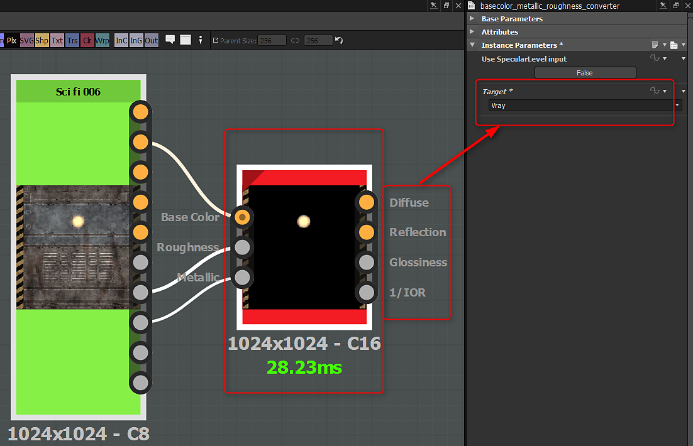

# Conversión de salidas de Substance

## Substance Painter

Puede exportar los mapas convertidos desde Substance Painter. Se admite una amplia gama de ajustes preestablecidos de procesamiento y, si selecciona un ajuste preestablecido, se convertirán los tipos de mapas. (la conversión se basa en el flujo de trabajo de metal/desbaste).

{width="800px"}

## Complemento de Substance

El complemento Substance generará salidas y creará automáticamente materiales para flujos de trabajo específicos. Sin embargo, con las aplicaciones de DCC y los procesadores de terceros, puede que necesite convertir manualmente las salidas metálicas/iniciales. Las siguientes integraciones admiten flujos de trabajo de representación automática y convertirán adecuadamente cualquier tipo de mapa si es necesario:

* [Substance en Maya](../../3d-applications/maya/using-workflows/using-workflows.md)
* [Substance en 3ds Max](../../3d-applications/3ds-max/3ds-max.md)

## Substance personalizados

Si está creando un Substance personalizado, puede crear las salidas específicas que necesita para los procesadores como Vray y Corona. Mediante el nodo de conversión de metal/rugosidad (Biblioteca>Utilidades PBR), puede convertir fácilmente los mapas de color base, rugosidad y metálicos al procesador específico.

{width="600px"}
