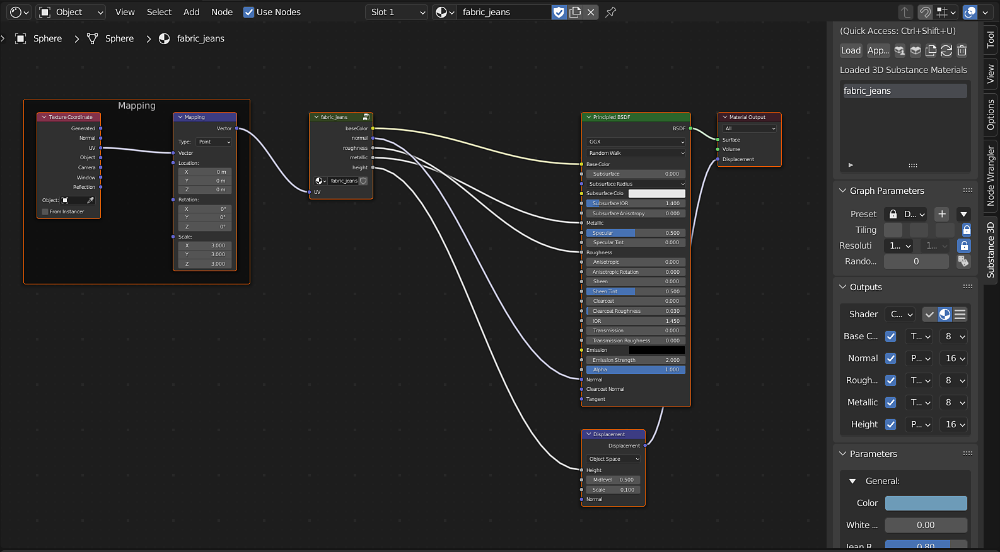

# Ciclos y eventos - Substance 3D para Blender

Con el plugin [Substance 3D for Blender](../../../3d-applications/blender/blender.md), el uso del botón **Cargar** para seleccionar un archivo .sbsar creará un material Blender con las salidas agrupadas conectadas a un nodo BSDF de Principled.\
La configuración de desplazamiento para el material creado se establece automáticamente en &quot;Desplazamiento y relieve&quot;.

