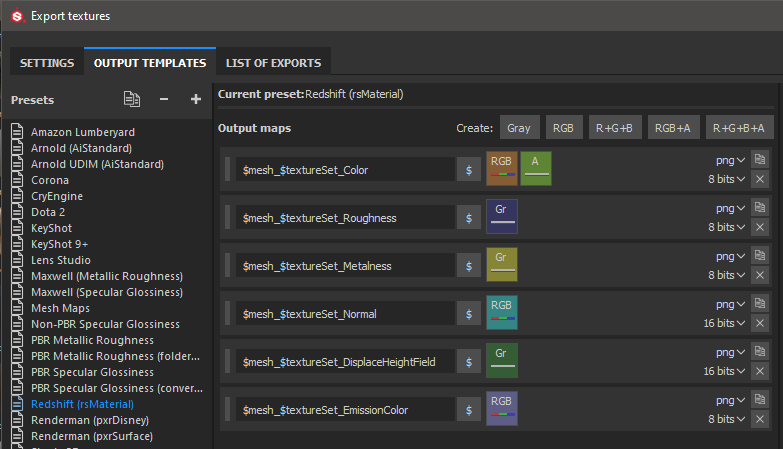

# Cambio de rojo - Substance Painter

Substance Painter 2020.1 (6.1.0) admite Redshift [Plantillas de salida](https://docs.substance3d.com/display/SPDOC/Export) para metales/rugosidad (rsMaterial). Simplemente puede exportar utilizando la plantilla Redshift para producir texturas que sean compatibles con los materiales Redshift.

## Configuración de material de Redshift

| Exportación de Substance Painter | Material de desplazamiento al rojo |
| --- | --- |
| Color | Difusión / Color |
| Rugosidad | Reflejo / Rugosidad (BRDF = GGX) |
| Metalicidad | Reflejo / Metalness (Fresnel Type = Metalness) |
| Normal | Global / Mapa de relieve / rsBumpMap (Tipo de mapa de entrada = Espacio tangente normal - Escala de Height = 1.0) |
| DesplazarCampoAlto | Sombreador de desplazamientos / rsAsignación de texto de desplazamiento (codificación de mapa = campo de Height) |
| EmissionColor | Total / Emisión (Peso De Emisión = 1,0) |

>[!NOTE]
>
> Los mapas que representan datos deberán interpretarse correctamente. Para obtener más información, consulta la página [Administración de color](../../../renderers/color-management/color-management.md).

## Ejemplo de Maya/Redshift

{width="800px"}
