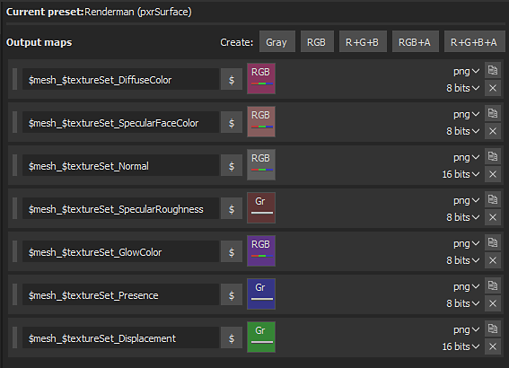

# Renderman - Substance Painter

Substance Painter 2020.1 (6.1.0) admite [**pxrSurface**](https://rmanwiki.pixar.com/display/REN/PxrSurface) y [Plantillas de salida](https://docs.substance3d.com/display/SPDOC/Export) de pxrDisney.

Se recomienda usar **pxrSurface** para el resultado.

## Renderman Shader (Maya - RM 23.1)

| Exportación de Substance Painter | PxrSurface |
| --- | --- |
| DiffuseColor | Difusión / Color |
| RugosidadEspecular | Specular principal / Rugosidad |
| SpecularFaceColor | Specular principal / Color de la cara |
| Normal | Globales / Rugosidad / PxrNormalMap → Orientación (Open GL) |
| Desplazamiento | (canal rojo) PxrDispTransform (Resultado F) → (disp escalar) PxrDisplace (Color de salida) → (Sombreado de Desplazamiento) PxrSurfaceSG |
| GlowColor | Resplandor/Color (ganancia = 1,0) |
| Presencia | Globales / Presencia |

>[!NOTE]
>
> Los mapas que representan datos deberán interpretarse correctamente. Para obtener más información, consulta la página [Administración de color](../../../renderers/color-management/color-management.md).
