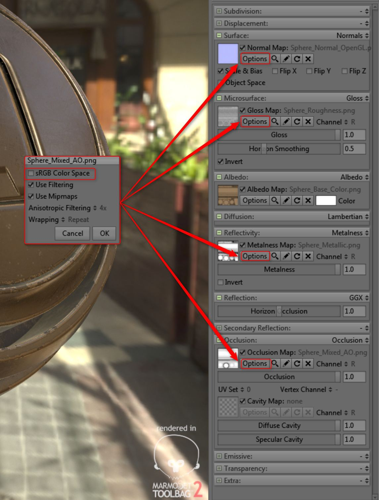

# Toolbag

Esta página muestra cómo utilizar las salidas de rugosidad/metálicas para la bolsa de herramientas 2.

La bolsa de herramientas admite los flujos de trabajo de specular/brillo y metálico/rugosidad.

Substance 3D Painter utiliza el sombreador PBR metálico como valor predeterminado; sin embargo, también puede utilizarlo con el sombreador specular/brillo. Este flujo de trabajo mostrará cómo utilizar las salidas metálicas para la bolsa de herramientas 2. Toolbag soporta el flujo de trabajo metálico.

[Descargar escena de ejemplo](https://www.dropbox.com/s/qyed3un2zhtuibj/toolbag.zip?dl=0)

## Exportar desde Painter

1. Al usar el sombreador PBR metálico predeterminado, podemos exportar usando el ajuste preestablecido Canales del documento + Normal + Exportación de AO predeterminado.  ***\*Los canales de documento exportan el mapa normal según la configuración del proyecto. La bolsa de herramientas requiere un mapa normal de OGL. Puede cambiar el formato normal en la configuración del proyecto.***
1. Como alternativa, puede crear una configuración de exportación personalizada que utilice brillo

   {width="600px"}
1. Puede cambiar el formato Normal a OpenGL antes de exportar.  **Editar>Configuración del proyecto**

   

## Configuración de material

1. Definir Reflectividad en Metalness
1. Definir reflejo en GX
1. Añada las texturas a los canales adecuados, como se muestra en el siguiente gráfico:

   | Textura de Substance 3D Painter | Espacio de color | Material de la bolsa |
   | --- | --- | --- |
   | Color base | sRGB | Albedo |
   | Rugosidad | sRGB desactivado | Microsuperficie - Brillo - Pulse Invertir |
   | Metálico | sRGB desactivado | Reflectividad - Mapa de Metalness |
   | Normal | sRGB desactivado | Normal |
   | Oclusión ambiental | sRGB desactivado | Oclusión |

{width="600px"}
