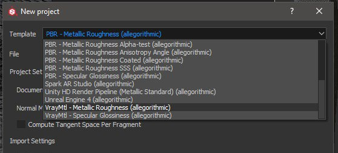

# Variar siguiente - Substance Painter

Substance Painter 2020.1 (6.1.0) se suministra con sombreadores [VrayMtl](https://docs.chaosgroup.com/display/VRAY4MAYA/VRayMtl) para flujos de trabajo metálicos y de specular. Puedes [configurar tu proyecto de Substance Painter](https://docs.substance3d.com/display/SPDOC/Project+Creation) con la **plantilla VrayMtl**, que configurará tu sombreador de ventana gráfica.

En Configuración del sombreador, puede configurar el sombreador Vray para trabajar con VrayMtl.

>[!NOTE]
>
> Si el proyecto se configuró para usar [UV Tile UDIM Legacy](https://helpx.adobe.com/es/substance-3d/unlisted/documentation/spdoc/uv-tile-udim-legacy-144310352.html). Utilice la plantilla de salida Vray Next UDIM.

{width="800px"}

Para exportar texturas para su procesamiento en Vray Next, seleccione la Plantilla de salida Vray Mtl.

{width="800px"}

## Material de varios colores (Siguiente de varios colores - Metálico/Rugosidad)

| Exportación de Substance Painter | VRayMtl |
| --- | --- |
| BaseColor | (**Maya**) Color de difusión (Cantidad = 1.0) (**3ds Max**) Difusión |
| Rugosidad | (**Maya**) Reflejo / Rugosidad (BRDF = GGX) + (Rugosidad de uso habilitada) (**3ds Max**) Rugosidad → BRDF/ Usar GGX y habilitar Rugosidad de uso |
| Metálico | (**Maya**) Reflejo/ Metalidad (**3ds Max**) Metalidad |
| Normal | (**Maya**) Mapa/Asignación normal y de relieve (Tipo de mapa = Normal en el espacio de tangente) (**3ds** **Max**) Mapa de bits → Normal |
| Altura | (**Maya**) Sombreador de Desplazamiento / desplazamiento (**3ds** **Max**) Modificador de objeto → VrayDisplacementMod → Mapa de texto |
| Emisivo | Autoiluminación |
| Transmisivo | (**Maya**) Dispersión subsuperficial / Color de translucidez (**3ds Max**) Translucidez → Color del reverso |
| ÁnguloDeAnisotropía | (**Maya**) Anisotropía / Rotación de Anisotropía (**3ds** **Max**) BRDF / Rotación |
| NivelDeAnisotropía | (**Maya**) Anisotropía / Anisotropía (**3ds Max**) BRDF / Ángulo |

## Vray Material (Vray Next - Specular/Brillo)

| Exportación de Substance Painter | VRayMtl |
| --- | --- |
| Difusión | (**Maya**) Color de difusión (Cantidad = 1.0) (**3ds Max**) Difusión |
| Especular | (**Maya**) Color de reflejo/reflejo (Cantidad = 1.0) (**3ds Max**) Reflejo |
| Brillo | (**Maya**) Reflejo / Rugosidad (BRDF = GGX) + (Rugosidad de uso habilitada) (**3ds Max**) Brillo → BRDF / Usar GGX y habilitar Usar brillo |
| Normal | (**Maya**) Mapa/Asignación normal y de relieve (Tipo de mapa = Normal en el espacio de tangente) (**3ds** **Max**) Mapa de bits → Normal |
| Altura | (**Maya**) Sombreador de Desplazamiento / desplazamiento (**3ds** **Max**) Modificador de objeto → VrayDisplacementMod → Mapa de texto |
| Emisivo | Autoiluminación |
| Transmisivo | (**Maya**) Dispersión subsuperficial / Color de translucidez (**3ds Max**) Translucidez → Color del reverso |
| ÁnguloDeAnisotropía | (**Maya**) Anisotropía / Rotación de Anisotropía (**3ds** **Max**) BRDF / Rotación |
| NivelDeAnisotropía | (**Maya**) Anisotropía / Anisotropía (**3ds Max**) BRDF / Ángulo |

>[!NOTE]
>
> Los mapas que representan datos deberán interpretarse correctamente. Para obtener más información, consulta la página [Administración de color](../../../renderers/color-management/color-management.md).

En este ejemplo, se muestra la ventana gráfica del Substance Painter con el sombreador Vray Metallic/Roughness y el procesamiento Vray con Maya.

{width="800px"}
